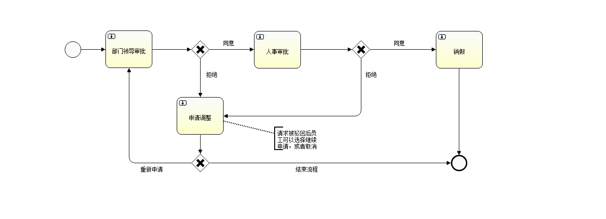

# workflowdemo

一个简单的请假流程，网页只显示html，没有复杂的js和css，方便大家理解

权限管理使用apache shiro

## 请假流程

推荐使用Activiti Eclipse BPMN 2.0 designer 编辑和查看`src\main\resources\leave.bpmn`

## Run

使用MySQL数据库

使用 Activiti 中的创建表的脚本和本项目下 doc/create table.sql 创建数据表，然后执行table data.sql

用户名 | 密码 | 角色
---|---|---
user01 | 123456 | 员工
user02 | 123456 | 部门领导
user02 | 123456 | 人事

注意：Activiti `ACT_ID_GROUP` 和 ROLE 所起到的作用不一样，ROLE是apache shiro用到的角色，`ACT_ID_GROUP`是Activiti中流程用到的角色，
在实际开发过程中需要同步这两张表，或者让Activiti使用ROLE的视图，让用户不用维护两套角色
